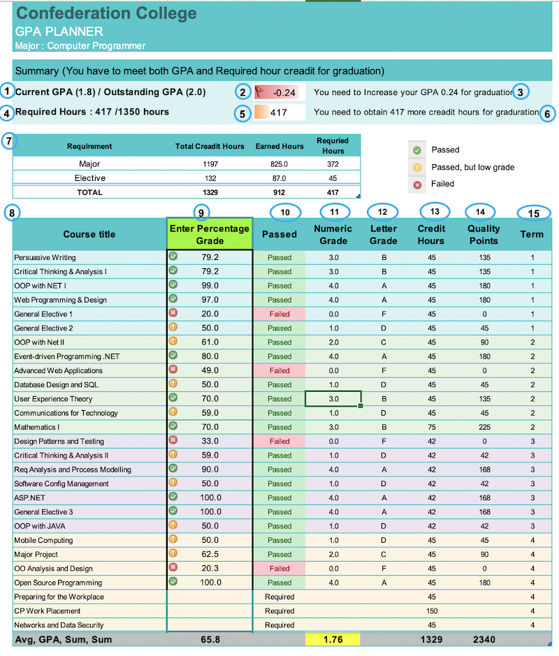

# GPA Calculator
This calculator helps students to know how much more minimum percentage grade they need to add onto their final graduating GPA for graduation.

## Features
* 100% Excel functions
* No required installing, it is pure excel file
* Input Validation
* Automatic result indicators (Pass, Failed)
* Easy customizing

## Contents
- [GPA Calculator](#gpa-calculator)
  - [Features](#features)
  - [Contents](#contents)
      - [1. GPA Compare](#1-gpa-compare)
      - [2. GPA Bar](#2-gpa-bar)
      - [3. IS GPA Enough](#3-is-gpa-enough)
      - [4. Required Hours Compare](#4-required-hours-compare)
      - [5. Hours Bar](#5-hours-bar)
      - [6. IS Hours Enough](#6-is-hours-enough)
      - [7. Credit/Earned Hours](#7-creditearned-hours)
      - [8. Course Title](#8-course-title)
      - [9. Enter Percentage Grade](#9-enter-percentage-grade)
      - [10. Passed](#10-passed)
      - [11. Numeric Grade](#11-numeric-grade)
      - [12. Letter Grade](#12-letter-grade)
      - [13. Credit Hours](#13-credit-hours)
      - [14. Quality Points](#14-quality-points)
      - [15. Term](#15-term)



#### 1. GPA Compare
Calculate current GPA and show with outstand GPA for graduation
```vbnet
= CONCATENATE("Current GPA (", TEXT( MainTable2[[#Totals],[Numeric Grade]],  "0.0"),   ") / Outstanding GPA (2.0)")
```

#### 2. GPA Bar
* Calculate and show how much GPA need, if not enough, bar colour will be red and number show minus. If enough, bar show green and number show plus with `Conditional Formatting` 
```vbnet
= MainTable[[#Totals],[Numeric Grade]] - 2
```

#### 3. IS GPA Enough
If GPA is not enough show the message "You need to increase GPA [number] for graduation", if enough "your GPA meets to graduation"
```vbnet
= IF(D7<0,CONCATENATE("  You need to Increase your GPA ",TEXT(D7*-1,"0.00"), " for graduation"),"  Your GPA meets to graduate ")
```

#### 4. Required Hours Compare
Calculate currently need required hours and show with Total Credit hours  for graduation
```vbnet
= CONCATENATE("Required Hours : ",  TEXT(Summary[[#Totals],[Requried Hours]], "0 "), "/1350 hours")
```

#### 5. Hours Bar 
Calculate and show how much the credit hours need, if not enough, bar colour will be orange and number show required hours. If enough, bar show green and number show 0
```vbnet
= (Summary[[#Totals],[Earned Hours]] - Summary[[#Totals],[Total Creadit Hours]]) * -1
```

#### 6. IS Hours Enough
If credit hours are not enough, show the message "You need to obtain [number] more credit hours for graduation", if enough "You've obtained all credit hours to graduate"
```vbnet
= IF(AND(D9<1350, D9 > 0),CONCATENATE("  You need to obtain ",TEXT(D9,"0")," more credit hours for graduation")," You've obtained all credit hours to graduate ")
```

#### 7. Credit/Earned Hours
* Show Sum of total credit hours of Major and Elective
* Show Sum of earned hours of Major and Elective
* Show Sum of required credit hours of Major and Elective
```vbnet
= SUMIF(D19:D22, "Passed", G19:G22) + SUMIF(D25:D36, "Passed", G25:G36) + SUMIF(D38:D45, "Passed", G38:G45)
=[@[Total Creadit Hours]]-[@[Earned Hours]]
```

#### 8. Course Title	
List all course title

#### 9. Enter Percentage Grade	
* Get Percentage grade from user, Data validation check for number with `Conditional Formatting` (Passed, Low grade, Failed)

#### 10. Passed	
If number is exist and if percentage grade is greater than 50 show passed, other wise show fail. If number does not exist show required
```vbnet
= IFS([@[Enter Percentage Grade]] = "", "Required", NOT(ISNUMBER([@[Enter Percentage Grade]])), "Invalid Input",  [@[Enter Percentage Grade]] < 50, "Failed", [@[Enter Percentage Grade]] >= 50, "Passed")
```

#### 11. Numeric Grade	
Base on grade table, show to Numeric grade
```vbnet
= IF(ISNUMBER([@[Enter Percentage Grade]]), VLOOKUP([@[Enter Percentage Grade]],GradeTable,3,TRUE)," ")
```

#### 12. Letter Grade	
Base on grade table, show to the letter grade
```vbnet
= IF(ISNUMBER([@[Enter Percentage Grade]]), VLOOKUP([@[Enter Percentage Grade]],GradeTable,2,TRUE), " ")
```

#### 13. Credit Hours	
List all credit hours

#### 14. Quality Points	
Show Credit hours * Numeric grade
```vbnet
= IF(ISNUMBER([@[Enter Percentage Grade]]),  [@[Credit Hours]]*[@[Numeric Grade]],  " ")
```

#### 15. Term
List all courses term
